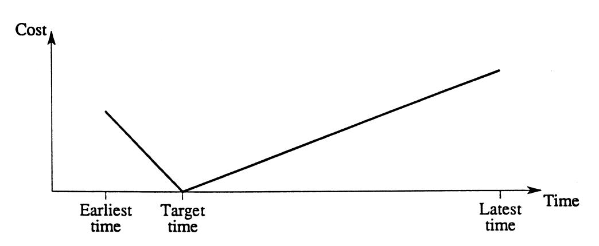

# Agendamento de Pousos de Aeronaves

Eduardo Henke

---

# Contexto do Problema

- Ao entrar no alcance do radar do controle de tráfego aéreo (ATC):
  - O avião precisa ser atribuído um **horário de pouso** $x_i$ dentro de uma janela de tempo específica $[E_i, L_i]$.
  - Se houver mais de uma pista, deve ser atribuída uma **pista** $r$ também.
- **Objetivo:** Garantir pousos seguros mantendo a separação entre aeronaves e minimizando os custos relacionados ao desvio do horário de pouso preferido $T_i$.

---

# Restrições

- **Janela de Tempo:**
  - Cada avião $i$ tem um horário de pouso mais cedo $E_i$ e um mais tarde $L_i$.
    - $E_i$: Horário mais cedo se o avião voar à velocidade máxima.
    - $L_i$: Horário mais tarde, considerando a eficiência de combustível e o tempo máximo de espera.
- **Tempo de Separação:**
  - Cada par de aviões $(i, j)$ deve manter um tempo mínimo de separação $S_{ij}$ entre seus pousos:
    - Exemplo: Um Boeing 747 precisa de mais tempo de separação em relação a um avião menor, por conta da turbulência gerada.

<!-- **Gráfico/Diagrama:** Gráfico de uma linha do tempo mostrando as janelas de tempo de pouso e as separações entre os aviões.  
Adicione aqui um gráfico de linha do tempo mostrando as janelas de pouso e o tempo de separação -->

---

# Função Objetivo - Minimizar o Custo Total

- O custo é incorrido quando o avião pousa antes ou depois do horário alvo $T_i$:
  - Pouso antes de $T_i$ gera um custo, pouso depois também.
  - O objetivo é minimizar a soma dos custos para todos os aviões.

---

# Exemplo: Caso de Pista Única

**Objetivo:** Determinar os horários de pouso $x_i$ para cada avião $i$ de forma que:
1. $x_i \in [E_i, L_i]$, ou seja, o avião pouse dentro da janela de tempo.
2. A condição de separação $x_j \geq x_i + S_{ij}$ seja respeitada para cada par de aviões $(i, j)$.

- **Exemplo Simples:**
  - O avião A tem uma janela de tempo de 10h às 10h30.
  - O avião B tem uma janela de 10h20 às 11h.
  - Se o tempo de separação for 10 minutos, o avião A deve pousar antes de B, com uma separação mínima de 10 minutos.

<!-- **Gráfico/Diagrama:** Diagrama de pista única com sequência de pousos e os intervalos de separação marcados.  
Adicione um diagrama de uma pista com a sequência de pousos e tempos de separação -->

---

# Representação da solução

- Representação da solução, é uma lista ordenada de pousos, onde um pouso é uma tupla `(ID Avião, Horário de Pouso)`.
- A estrutura de vizinhança então será pegar um pouso aleatório e mudar o seu tempo aleatoriamente, respeitando a janela de tempo do avião ($E_i$, $L_i$).

---

# Complexidades Práticas

- **Alocação de Pistas:** Para várias pistas, além do horário de pouso, deve-se alocar cada avião a uma pista $r$.
  - Exemplo: Dois aviões podem pousar ao mesmo tempo se estiverem em pistas separadas.
- **Outras Complexidades:**
  - A gestão em tempo real das operações.
  - Garantir que aviões maiores não afetem os menores devido à turbulência.
  - Tempo de espera no ar ou no solo, conforme a disponibilidade dos portões.

<!-- **Gráfico/Diagrama:** Ilustração de um aeroporto com várias pistas, mostrando aviões pousando em diferentes horários e pistas.  
Adicione um diagrama de um aeroporto com múltiplas pistas e pousos acontecendo -->

---

# Aplicações e Conclusão

- **Aeroportos** : Agendamento eficiente de pousos reduz custos e aumenta a segurança.
- **Otimização do Tráfego Aéreo** : Maximiza o uso das pistas, minimizando atrasos e custos de combustível.
- **Ajustes em Tempo Real** : Os princípios podem ser aplicados a mudanças como condições meteorológicas ou atrasos inesperados.
- **Métodos de Otimização** : Técnicas como metaheurísticas ajudam a maximizar a capacidade das pistas e reduzir atrasos.

